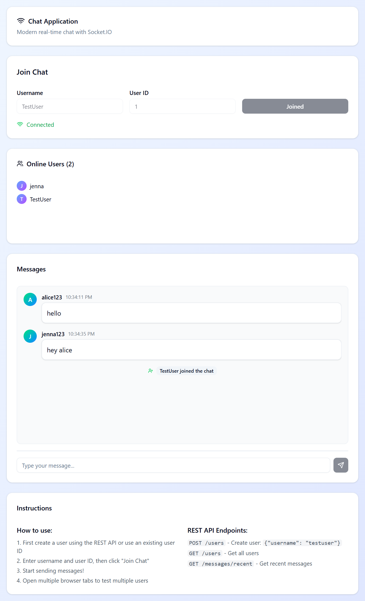

# Tewedj Chat Client

A modern, real-time chat application built with React, TypeScript, Vite, and Socket.IO. Features a beautiful UI designed with shadcn/ui components and Tailwind CSS.



## ✨ Features

### 🎨 **Modern UI/UX**
- Beautiful gradient backgrounds and modern design
- Responsive layout that works on all devices
- shadcn/ui components for consistent styling
- Clean typography and intuitive interface
- Avatar system with user initials
- Real-time status indicators

### 💬 **Real-time Chat**
- Instant messaging with Socket.IO
- Live user presence indicators
- Online users list with avatars
- System notifications (user joined/left)
- Message timestamps
- Auto-scroll to latest messages
- Enter key support for quick messaging

### 🔧 **User Management**
- Easy user registration with username and ID
- Connection status monitoring
- Join/leave chat functionality
- User typing indicators support
- Error handling and status notifications

### 🌐 **Technical Features**
- TypeScript for type safety
- Vite for fast development and building
- Socket.IO for real-time communication
- React Router support
- ESLint for code quality
- Tailwind CSS for styling

## 🚀 Quick Start

### Prerequisites
- Node.js 18+ 
- pnpm (recommended) or npm
- A Socket.IO backend server running on port 3000

### Installation

1. **Clone the repository**
   ```bash
   git clone <repository-url>
   cd tewedj-client
   ```

2. **Install dependencies**
   ```bash
   pnpm install
   ```

3. **Start the development server**
   ```bash
   pnpm dev
   ```

4. **Open your browser**
   Navigate to `http://localhost:5173`

### Using the Application

1. **Join the Chat**
   - Enter your username (default: "TestUser")
   - Enter your user ID (default: 1)
   - Click "Join Chat"

2. **Start Chatting**
   - Type your message in the input field
   - Press Enter or click the Send button
   - See real-time messages from other users

3. **Monitor Online Users**
   - View all online users in the sidebar
   - See when users join or leave
   - Real-time user presence updates

## 🐳 Docker Support

This project includes comprehensive Docker support for both development and production environments.

### Development with Docker
```bash
# Start development container with hot reload
docker-compose up tewedj-client-dev
```

### Production with Docker
```bash
# Start production container with Nginx
docker-compose --profile production up tewedj-client-prod
```

For detailed Docker instructions, see the Docker documentation in the project files.

## 📁 Project Structure

```
tewedj-client/
├── src/
│   ├── pages/
│   │   └── home/
│   │       └── index.tsx          # Main chat interface
│   ├── global/
│   │   └── shadcn/
│   │       └── components/ui/     # shadcn/ui components
│   └── main.tsx                   # Application entry point
├── public/                        # Static assets
├── chat-app-ui/                   # UI screenshots
├── Dockerfile                     # Docker configuration
├── docker-compose.yml            # Docker Compose setup
├── nginx.conf                     # Production Nginx config
└── README.md                      # This file
```

## 🛠️ Available Scripts

```bash
# Development
pnpm dev          # Start development server
pnpm build        # Build for production
pnpm preview      # Preview production build
pnpm lint         # Run ESLint

# Docker Development
docker-compose up tewedj-client-dev

# Docker Production
docker-compose --profile production up tewedj-client-prod
```

## 🔧 Configuration

### Environment Variables

Create a `.env` file in the project root:

```env
VITE_API_URL=http://localhost:3000
VITE_SOCKET_URL=http://localhost:3000
VITE_APP_NAME=Tewedj Chat Client
```

### Backend Integration

This frontend connects to a Socket.IO backend server. Make sure your backend server supports these events:

#### **Client Events (Sent by Frontend):**
- `joinChat` - Join the chat room
- `sendMessage` - Send a new message

#### **Server Events (Received by Frontend):**
- `connect` / `disconnect` - Connection status
- `recentMessages` - Load message history
- `newMessage` - Receive new messages
- `userJoined` / `userLeft` - User presence updates
- `onlineUsers` - Current online users list
- `userTyping` - Typing indicators
- `error` - Error handling

## 🎨 UI Components

The application uses shadcn/ui components for a modern, accessible interface:

- **Card** - Container components for different sections
- **Button** - Interactive elements with proper states
- **Input** - Text input fields with validation
- **Avatar** - User profile pictures with fallbacks
- **Badge** - Status indicators and notifications
- **ScrollArea** - Smooth scrolling message containers
- **Separator** - Visual dividers between sections

## 🔗 API Endpoints

The application works with these REST API endpoints:

- `POST /users` - Create new user: `{"username": "testuser"}`
- `GET /users` - Get all users
- `GET /messages/recent` - Get recent chat messages

## 🌟 Key Features Showcase

### Real-time Messaging
- Instant message delivery and receipt
- Live typing indicators
- Message history persistence
- Auto-scroll to latest messages

### User Experience
- Modern, responsive design
- Intuitive navigation
- Visual feedback for all actions
- Error handling with user-friendly messages

### Performance
- Optimized with Vite for fast loading
- Efficient Socket.IO connections
- Minimal bundle size with tree shaking
- Production-ready with Docker and Nginx

## 🤝 Contributing

1. Fork the repository
2. Create a feature branch (`git checkout -b feature/amazing-feature`)
3. Commit your changes (`git commit -m 'Add some amazing feature'`)
4. Push to the branch (`git push origin feature/amazing-feature`)
5. Open a Pull Request

## 📄 License

This project is licensed under the MIT License - see the LICENSE file for details.

## 🙏 Acknowledgments

- Built with [React](https://reactjs.org/) and [TypeScript](https://www.typescriptlang.org/)
- UI components from [shadcn/ui](https://ui.shadcn.com/)
- Styled with [Tailwind CSS](https://tailwindcss.com/)
- Real-time communication with [Socket.IO](https://socket.io/)
- Icons from [Lucide React](https://lucide.dev/)
- Bundled with [Vite](https://vitejs.dev/)

---

**Built with ❤️ for real-time communication**
